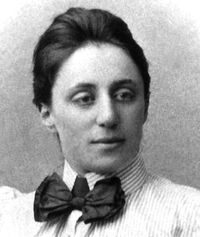

#Lecture 3: Matrix Decompositions

---

#Emmy Noether

 
 

"My methods are really methods of working and thinking; this is why they have crept in everywhere anonymously."

* 1931 letter to Helmut Hasse 

---

#Notation 

In this course we will notate vectors $x,y,z \in \mathbb{R}^m$ with no special identifiers ('vector' here means a $m \times 1$ column vector). Scalars will be identified by letters in the Greek alphabet (e.g. $\lambda, \mu, \sigma$), and the beginning of the English alphabet (e.g. $a, b, c$).
$$
$$
Matrices $A \in \mathbb{R}^{n \times m}$, which represent linear transformations from $\mathbb{R}^m \to \mathbb{R}^n$ with respect to some basis, will always be denoted with capital (English or Greek) letters. 

---

Outer and inner products between vectors will be written using matrix notation, so $xx^T$ is a $m \times m$ matrix of rank 1 and $x^Tx$ is a $1 \times 1$ matrix whose value is $\|x\|^2$.
$$
$$
Given two matrices $A$  and $B$, their product can be computed as a sum of either inner or outer products of the rows of $A$ and columns of $B$, or columns of $A$ and rows of $B$ respectively. 
 
 
The resulting product $AB$ is the same, however the choice of method will often have computational ramifications.

---

#Exercise

Compute $A^2$ using both inner and outer product methods.

$$
A = 
\begin{pmatrix}
1 & 2 \\\
3 & 4 \\\
\end{pmatrix} 
$$

---

#Positive Definite Matrices

A matrix $A$ is symmetric if $A = A^T$. A symmetric matrix $A$ is positive definite (often written $A \geq 0$) if the scalar $x^TAx \geq 0$ for all $x \neq 0$.
$$
$$
Positive definite matrices are closely related to positive-definite symmetric bilinear forms, and to inner products of vector spaces.

---

#Properties

Let $A \in \mathbb{R}^{n \times n}$ be a symmetric matrix. $A \geq 0$ if and only if:

* $x^TAx \geq 0$ for all $x \neq 0$
* The eigenvalues of $A$ are all positive.
* $A$ is the [Gramian matrix](https://en.wikipedia.org/wiki/Gramian_matrix) matrix of $n$ linearly independent vectors: $A = X^TX$ (see also Mercer's Theorem).
* $A$ has a unique Cholesky decomposition: $ A = L L^T$, where L is a lower triangular matrix with real and positive diagonal entries.

---

#Exercise 

Show that
$$
A = \begin{pmatrix} 2&-1&0 \\\ -1&2&-1 \\\ 0&-1&2 \end{pmatrix} 
$$
is positive definite.

---

#Application: Covariance Matrices

Given $N$ data vectors $x_i \in \mathbb{R}^d$, the sample covariance matrix is a $d \times d$ matrix $A$:

$$
A = {1 \over {N}}\sum_{i=1}^N (x_i-\bar{x}) (x_i-\bar{x})^\mathrm{T}
$$

If the $x_i$ are mean-centered and considered as rows in a data matrix $X$, then the sample covariance is simply a scalar multiple of $X^TX$, the Gramian of $X$.

---

#Spectral Theorem

__Theorem:__  Let $A: \mathcal{V} \to \mathcal{V}$ be symmetric (Hermitian). There exists an orthonormal basis of $\mathcal{V}$ consisting of eigenvectors $e_i$ of $A$. Each eigenvalue $\sigma_i$ is real. In other words
$$
A = E \Sigma E^T
$$
where $E$ is orthogonal ($E^T = E^{-1}$) and $\Sigma$ is a diagonal matrix of real eigenvalues $\sigma_i$.

---

#Application: PCA

We can apply the spectral theorem to any symmetric matrix, in particular we can apply it to Gramian matrices $X^TX$ coming from sample covariances. 
$$
$$
We call this the Principal Components Analysis of $X$. 

.notes: PCA is an orthogonal linear transformation that transforms the data to a new coordinate system such that the greatest variance by some projection of the data comes to lie on the first coordinate, the second greatest variance on the second coordinate, and so on.

---

A full set of real-valued eigenvalues $\sigma_i$ of $X^TX$ exist (by the Spectral Theorem), furthermore they are positive (by positive definiteness). 
$$
$$
In the context of PCA $e_i$ is the i-th principal component and $\sigma_i$ is the sample variance of the dataset in the direction of $e_i$.

---

PCA can be thought of as fitting a multivariate normal distribution $\mathcal{N}(\mu, \Sigma)$ to the data by maximum liklihood. 
$$
$$
Each axis of the ellipsoid defined by $\hat{\Sigma} = X^TX $ represents a principal component. 
$$
$$
If some axis of the ellipse is small, then the variance along that axis is also small, and by omitting that axis and its corresponding principal component from our representation of the dataset, we lose only a commensurately small amount of information.

---

To find the axes of the ellipse, we mean-center the data and compute the covariance matrix $X^TX$, then calculate the eigenvalues and corresponding eigenvectors of this covariance matrix. 
$$
$$
Finally, we [normalize](https://en.wikipedia.org/wiki/Gram%E2%80%93Schmidt_process) the eigenvectors and sort according to eigenvalue: $\sigma_1 \geq \sigma_2 \geq \cdots \geq \sigma_n$

---

#Exercise

Compute the PCA of the following data matrix $X$:

$$
X =
\begin{pmatrix}
1 & 2 \\\
2 & 1 \\\
3 & 4 \\\
4 & 3 \\\
\end{pmatrix} 
$$

---

For large matrices, working directly with the eigenvalue problem $X^TX$ is numerically unstable in finite precision arithmetic.
$$
$$
We will therefore explore two alternate solution methods, the latter of which will be useful for our explorations of latent variable models later in the course.

---

One can also frame the principal component vectors $e_i$ as solutions to a series of optimization problems involving [Rayleigh quotients](https://en.wikipedia.org/wiki/Rayleigh_quotient):
\begin{align}
e_1 &= \max_{\|v\|=1} \|X v\|^2 = \max_{\|v\|=1} v^T X^TX v =  \max \frac{v^T X^TX v}{\|v\|}
\newline
e_2 &= \max_{v \in \mathcal{Im}(e_1)^\perp} \frac{v^T X^TX v}{\|v\|}
\newline
e_3 &= \max_{v \in \mathcal{Im}(e_1,e_2)^\perp} \frac{v^T X^TX v}{\|v\|}
\newline
\dots
\end{align}

Where the space $\mathcal{Im}(e_1)^\perp$ is the orthogonal complement of $\mathcal{Im}(e_1)$.
$$
$$
This is essentially a rephrasing of the [Courant minimax principle](https://en.wikipedia.org/wiki/Courant_minimax_principle).

---

#SVD

The Singular Value Decomposition is a useful generalization of the spectral theorem on positive definite matrices to rectangular matrices.
$$
$$
__Theorem:__  Let $A :\mathcal{X} \to \mathcal{Y}$ be a linear map between finite dimensional inner product spaces. There is an orthonormal basis $\\{v_1, \cdots, v_m\\}$ for $\mathcal{X}$ such that $ (Av_i)^TAv_j = 0$ if $i \neq j$. 
 
 
Furthermore, we can find an orthonormal basis for $\mathcal{Y}$, and non-negative values $\sigma_1, \cdots, \sigma_r$ such that:

\begin{align}
Av_1 = \sigma_1 u_1, \cdots, Av_r &= \sigma_r u_r,
\newline
Av_{r+1}  = 0, \cdots,  Av_m &= 0         
\end{align}
for some $r \leq m$. In matrix form we have:
$$
A = \sum_i \sigma_i u_i v_i^T = U \Sigma V^T  
$$

---

We sketch a proof as follows: use the spectral theorem on $A^TA$ to find an orthonormal basis $\\{v_1, \cdots, v_m\\}$ for $\mathcal{X}$ such that $A^TAv_i = \lambda v_i$. This gives the first part, since
$$
(Av_i)^TAv_j = v_i^T A^T A v_j = v_i^T \lambda_j v_j = \lambda_j \delta_{ij}
$$
where $\delta_{ij}$ is the Dirac delta function.
 
 
Next we reorder the basis if necessary so that the $r$ non-zero eigenvectors come first. We then define
$$
u_i = \frac{Av_i}{\|Av_i \|}
$$
for $i = 1, \cdots, k$. Finally select $u_{k+1}, \cdots, u_n$ to complete the orthonomal basis for $\mathcal{Y}$. 
 
 
The values $\sigma_i = \sqrt{\lambda_i}$ are known as the singular values of $ A $.

---

#Example

The following is an SVD for arbitrary values of $\theta \in \mathbb{R}$:
 
 

$$
\begin{pmatrix} 1 & 0 \\\ 0 & -1 \end{pmatrix} = 
\begin{pmatrix} \cos(\theta) & \sin(\theta) \\\ - \sin(\theta) & \cos(\theta) \end{pmatrix} 
\begin{pmatrix} 1 & 0 \\\ 0 & 1 \end{pmatrix} 
\begin{pmatrix} \cos(\theta) & \sin(\theta) \\\  \sin(\theta) & - \cos(\theta) \end{pmatrix} 
$$

---

#Example

The following is an SVD 
 
 
$$
\begin{pmatrix} 1 & 1 & 1 & 0 & 0 \\\ 3 & 3 & 3 & 0 & 0 \\\ 4 & 4 & 4 & 0 & 0 \\\ 5 & 5 & 5 & 0 & 0 \\\ 0 & 0 & 0 & 4 & 4 \\\  0 & 0 & 0 & 5 & 5 \\\  0 & 0 & 0 & 2 & 2 \end{pmatrix} = 
\begin{pmatrix} .14 & 0 \\\ .42 & 0 \\\ .56 & 0 \\\ .70 & 0 \\\ 0 & .60 \\\ 0 & .75 \\\ 0 & .30  \end{pmatrix} 
\begin{pmatrix} 12.4 & 0 \\\ 0 & 9.5 \end{pmatrix} 
\begin{pmatrix} .58 & .58 & .58 & 0 & 0 \\\ 0 & 0 & 0 & .71 & .71 \end{pmatrix} 
$$

---

#Example

The SVD of the matrix $X$ from above is:
$$
\begin{pmatrix}
1 & 2 \\\
2 & 1 \\\
3 & 4 \\\
4 & 3 \\\
\end{pmatrix} 
=
\begin{pmatrix}
\frac{3}{\sqrt{116}} & \frac{1}{2} \\\
\frac{3}{\sqrt{116}} & -\frac{1}{2} \\\
\frac{7}{\sqrt{116}} & \frac{1}{2} \\\
\frac{7}{\sqrt{116}} & -\frac{1}{2} \\\
\end{pmatrix} 
\begin{pmatrix}
\sqrt{58} & 0 \\\
0 & \sqrt{2} \\\
\end{pmatrix} 
\begin{pmatrix}
\frac{1}{\sqrt{2}} & \frac{1}{\sqrt{2}} \\\
-\frac{1}{\sqrt{2}} & \frac{1}{\sqrt{2}}  \\\
\end{pmatrix} 
$$

---

The proof of the SVD decomposition theorem suggests that the SVD of a matrix $X$ is closely related to the eigenvectors of $X^TX$. Working backwards we have:

\begin{align}
X^TX &= (U \Sigma V^T )^T U \Sigma V^T  
\newline
&= V \Sigma^T U^T U  \Sigma    V^T 
\newline
&=  V  \Sigma^2  V^T      
\end{align}

---

The full set of $T$ transformed coordinates from the PCA of $X$ can then be written as
\begin{align}
T & = X V \\\
& = U\Sigma V^T V \\\
& = U\Sigma
\end{align}
so each column of $T$ is given by one of the left singular vectors of $X$ multiplied by the corresponding singular value. 
 
 
Computing the SVD is the standard way to calculate the PCA of a data matrix.

---

The SVD can also used to compute a rank-$k$ approximation of $X$:
$$
$$
__Proposition:__ The rank-$k$ SVD approximation of $X$ is equivalent to a reconstruction of $X$ from its first $k$ principal components.

Let $U \Sigma_k V^T$ be a truncated SVD of $X$. We know $Z = X V$, so

$$
Z_k = U \Sigma_k V^T V = U \Sigma_k 
$$  
The reconstruction of $X$ from its first $k$ principal components is given by $X_k = Z_k V^T$ so
$$
X_k = Z_k V^T = U \Sigma_k V^T
$$
as above.

---

#Application: Image Compression

$A_k$ requires $\mathcal{O}(nk + k + km)$ storage. So for example using a rank-20 approximation to a $1000 \times 800$ image would result in a compression ratio of:
$$
\frac{800,000}{1,000 \cdot 20 + 20 + 20 \cdot 800 } \sim 22.21
$$
which is [competitive](http://blog.codinghorror.com/a-comparison-of-jpeg-compression-levels-and-recompression/) with the jpg file format.

---

&nbsp;&nbsp;&nbsp;&nbsp;&nbsp;&nbsp;&nbsp;&nbsp;&nbsp;&nbsp;&nbsp;&nbsp;&nbsp;&nbsp;&nbsp;&nbsp;&nbsp;&nbsp;&nbsp;&nbsp;&nbsp;&nbsp;&nbsp;&nbsp;&nbsp;&nbsp;&nbsp;&nbsp;&nbsp;&nbsp;&nbsp;&nbsp;&nbsp;&nbsp;[source](http://cg.skeelogy.com/svd-image-compression/)

However an equivalently-sized jpg file will generally look better because the jpg compression algorithm uses a basis in which most image signals are sparse.

.notes: Of course it doesnt look nearly as good, b/c the Frobenius norm is not how the human eye works. for better results we need sparse dictionaries.

