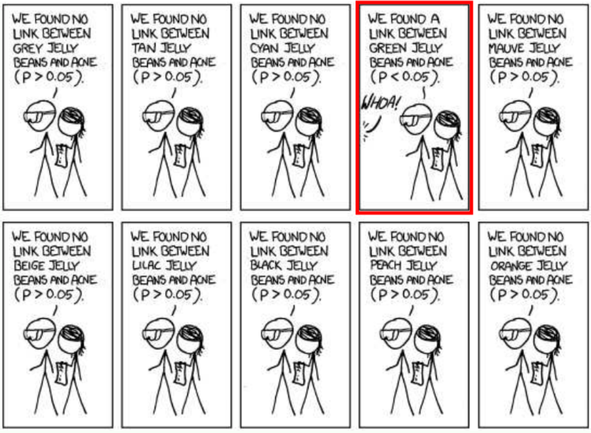
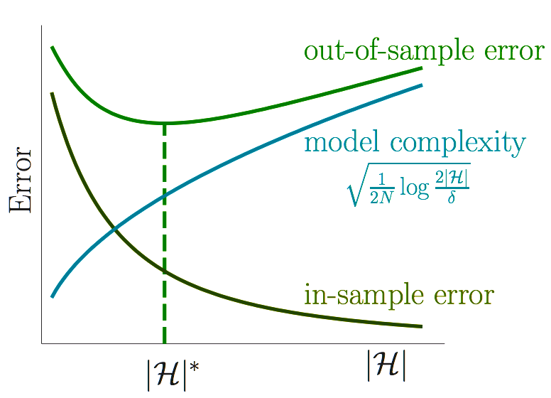

  <big><b>Models</b></big>  
   

  <code>{amitoj, dami, chris}@datascience.com</code>
   
   

---

#Resources

* Hastie, Tibshirani and Friedmans's [Elements of Statistical Learning](https://web.stanford.edu/H^castie/local.ftp/Springer/OLD/ESLII_print4.pdf)
* Murphy's [Machine Learning: A Probabilistic Approach](http://www.amazon.com/Machine-Learning-Probabilistic-Perspective-Computation/dp/0262018020)
* This course's [Confluence Page](https://ds12residency.atlassian.net/wiki/display/MOD/Models)

---

#Lecture 1: Learning

---

"Data analysis is a very difficult field. It must adapt itself to what people can and
need to do with data. In the sense that biology is more complex than physics, and the
behavioral sciences are more complex than either, it is likely that the general problems
of data analysis are more complex than those of all three."

* John Tukey and M.B. Wilk, [Data Analysis and Statistics, An Exploratory Overview](https://www.computer.org/csdl/proceedings/afips/1966/5068/00/50680695.pdf), 1966

---

In the above paper Tukey and Wilk identified four major influences acting on data analysis:

1. The formal theories of statistics
2. Accelerating developments in computers and display devices
3. The challenge, in many fields, of more and ever larger bodies of data
4. The emphasis on quantification in an ever wider variety of disciplines

Tukey and Wilk's list is surprisingly modern. However in 1966 their viewpoint was practically heretical within the statistics community.

---

In a 2001 paper entitled [‘Statistical Modeling: The Two Cultures’](http://projecteuclid.org/euclid.ss/1009213726), Leo Breiman described two cultural outlooks about extracting information from data.
$$
$$

> Statistics starts with data. Think of the data as being generated by a black box in which a vector of input variables x (independent variables) go in one side, and on the other side the response variables y come out. Inside the black box, nature functions to associate the predictor variables with the response variables.

---

Breiman says that users of data split into two cultures, based on their primary allegiance to one or the other of the following goals:

* Inference: to infer how nature is associating the response variables to the input variables.

* Prediction: to be able to predict what the responses are going to be to future input variables.

These two cultures though about statistical modeling in different ways.

---

#Generative modeling:

One proposes a stochastic model that could have generated the data, and derives methods to infer properties of the underlying generative mechanism (e.g. as in linear discriminant analysis). 
$$
$$
This roughly speaking coincides with traditional academic statistics and its offshoots. 
$$
$$
Implicit in this viewpoint is the notion that there is a true model generating the data, and often a truly ‘best’ way to analyze the data .

---

#Predictive modeling

One constructs methods which predict well over some some given data universe – i.e. some very specific concrete dataset. 
$$
$$
This roughly coincides with modern machine Learning, and its industrial offshoots. 
$$
$$
Predictive modeling (e.g. as in logistic regression) is effectively silent about the underlying mechanism generating the data, and allows for many different predictive algorithms, preferring to discuss only accuracy of prediction.

---

Another interesting manifestation of this trend was the [public argument](http://www.tor.com/blogs/2011/06/norvig-vs-chomsky-and-the-fight-for-the-future-of-ai) between Noam Chomsky and Peter Norvig on the nature of language. 
$$
$$
Chomsky long ago proposed a hierarchical model of formal language grammars. Peter Norvig is a proponent of probabilistic models of language. 
$$
$$
Indeed all successful automated language processing systems are probabilistic.

---

#Supervised Learning

* unknown target function (the black box) $f: \mathcal{X} \to \mathcal{Y}$
* training examples $(x_1,y_1), \dots, (x_N, y_N)$
* set of hypothesis functions (the model) $\mathcal{H}$
* training algorithm $\mathcal{A}$ (optimization problem plus optimizer).
* final hypothesis $h \in \mathcal{H}, h \sim f$.

Note that models and training algorithms are largely independent. For example, linear regression could be trained by the normal equations or by gradient descent, decision trees could be trained by entropy or gini impurity, etc.

---

#Challenge Question

In the following binary classification example, let $ \mathcal{X} = \\{0,1\\}^3$. 

 

<table class="tg">
  <tr>
    <th class="tg-9hbo">$x_i$</th>
    <th class="tg-9hbo">$y$</th>
  </tr>
  <tr>
    <td class="tg-yw4l">(0,0,0)</td>
    <td class="tg-9hbo">0</td>
  </tr>
  <tr>
    <td class="tg-yw4l">(0,0,1)</td>
    <td class="tg-9hbo">1</td>
  </tr>
  <tr>
    <td class="tg-yw4l">(0,1,0)</td>
    <td class="tg-9hbo">1</td>
  </tr>
  <tr>
    <td class="tg-yw4l">(0,1,1)</td>
    <td class="tg-9hbo">0</td>
  </tr>
  <tr>
    <td class="tg-yw4l">(1,0,0)</td>
    <td class="tg-yw4l">1</td>
  </tr>
</table>

How large is $\mathcal{H} = \\{ h | h: \mathcal{X} \to \\{0,1\\} \\}$?
$$
$$
How many functions $h \in \mathcal{H}$ agree with $f$ on the data?

---

---

 

<table class="tg">
  <tr>
    <th class="tg-9hbo">$x_i$</th>
    <th class="tg-9hbo">$y$</th>
    <th class="tg-9hbo">$h_0(x_i)$</th>
    <th class="tg-9hbo">$h_1(x_i)$</th>
    <th class="tg-9hbo">$h_2(x_i)$</th>
    <th class="tg-9hbo">$h_3(x_i)$</th>
    <th class="tg-9hbo">$h_4(x_i)$</th>
    <th class="tg-9hbo">$h_5(x_i)$</th>
    <th class="tg-9hbo">$h_6(x_i)$</th>
    <th class="tg-9hbo">$h_7(x_i)$</th>
  </tr>
  <tr>
    <td class="tg-yw4l">(0,0,0)</td>
    <td class="tg-9hbo">0</td>
    <td class="tg-9hbo">0</td>
    <td class="tg-9hbo">0</td>
    <td class="tg-9hbo">0</td>
    <td class="tg-9hbo">0</td>
    <td class="tg-9hbo">0</td>
    <td class="tg-9hbo">0</td>
    <td class="tg-9hbo">0</td>
    <td class="tg-9hbo">0</td>
  </tr>
  <tr>
    <td class="tg-yw4l">(0,0,1)</td>
    <td class="tg-9hbo">1</td>
    <td class="tg-9hbo">1</td>
    <td class="tg-9hbo">1</td>
    <td class="tg-9hbo">1</td>
    <td class="tg-9hbo">1</td>
    <td class="tg-9hbo">1</td>
    <td class="tg-9hbo">1</td>
    <td class="tg-9hbo">1</td>
    <td class="tg-9hbo">1</td>
  </tr>
  <tr>
    <td class="tg-yw4l">(0,1,0)</td>
    <td class="tg-9hbo">1</td>
    <td class="tg-9hbo">1</td>
    <td class="tg-9hbo">1</td>
    <td class="tg-9hbo">1</td>
    <td class="tg-9hbo">1</td>
    <td class="tg-9hbo">1</td>
    <td class="tg-9hbo">1</td>
    <td class="tg-9hbo">1</td>
    <td class="tg-9hbo">1</td>
  </tr>
  <tr>
    <td class="tg-yw4l">(0,1,1)</td>
    <td class="tg-9hbo">0</td>
    <td class="tg-9hbo">0</td>
    <td class="tg-9hbo">0</td>
    <td class="tg-9hbo">0</td>
    <td class="tg-9hbo">0</td>
    <td class="tg-9hbo">0</td>
    <td class="tg-9hbo">0</td>
    <td class="tg-9hbo">0</td>
    <td class="tg-9hbo">0</td>
  </tr>
  <tr>
    <td class="tg-yw4l">(1,0,0)</td>
    <td class="tg-yw4l">1</td>
    <td class="tg-9hbo">1</td>
    <td class="tg-9hbo">1</td>
    <td class="tg-9hbo">1</td>
    <td class="tg-9hbo">1</td>
    <td class="tg-9hbo">1</td>
    <td class="tg-9hbo">1</td>
    <td class="tg-9hbo">1</td>
    <td class="tg-9hbo">1</td>
  </tr>
  <tr>
    <td class="tg-yw4l">(1,0,1)</td>
    <td class="tg-yw4l">?</td>
    <td class="tg-9hbo">0</td>
    <td class="tg-9hbo">0</td>
    <td class="tg-9hbo">0</td>
    <td class="tg-9hbo">0</td>
    <td class="tg-9hbo">1</td>
    <td class="tg-9hbo">1</td>
    <td class="tg-9hbo">1</td>
    <td class="tg-9hbo">1</td>
  </tr>
  <tr>
    <td class="tg-yw4l">(1,1,0)</td>
    <td class="tg-yw4l">?</td>
    <td class="tg-9hbo">0</td>
    <td class="tg-9hbo">0</td>
    <td class="tg-9hbo">1</td>
    <td class="tg-9hbo">1</td>
    <td class="tg-9hbo">0</td>
    <td class="tg-9hbo">0</td>
    <td class="tg-9hbo">1</td>
    <td class="tg-9hbo">1</td>
  </tr>
  <tr>
    <td class="tg-yw4l">(1,1,1)</td>
    <td class="tg-yw4l">?</td>
    <td class="tg-9hbo">0</td>
    <td class="tg-9hbo">1</td>
    <td class="tg-9hbo">0</td>
    <td class="tg-9hbo">1</td>
    <td class="tg-9hbo">0</td>
    <td class="tg-9hbo">1</td>
    <td class="tg-9hbo">0</td>
    <td class="tg-9hbo">1</td>
  </tr>
</table>

---

You cannot know anything for sure about $f$ outside the data without making assumptions. This fact is often referred to as the [No Free Lunch Theorem](http://www.no-free-lunch.org/Wolp01a.pdf), which states that there is no one model that works best for every problem. 
$$
$$
The assumptions of a great model for one problem may not hold for another problem, so it is common in machine learning to try multiple models and find one that works best.
$$
$$  
It is also important to assess the implementation trade-offs between different models from the application's perspective.

---

#Many other tradeoffs in ML

* Frequentist vs Bayesian
* Supervised vs Unsupervised
* Classification vs Regression
* [Generative vs Discriminative](http://stackoverflow.com/questions/879432/what-is-the-difference-between-a-generative-and-discriminative-algorithm)
* [Bias vs Variance](https://en.wikipedia.org/wiki/Bias%E2%80%93variance_tradeoff)
* [Parametric vs non-parametric](https://www.quora.com/What-is-the-difference-between-the-parametric-model-and-the-non-parametric-model)
* [Low dimensions vs high dimensions](https://en.wikipedia.org/wiki/Curse_of_dimensionality)

---

#Feasibility of learning

Is there any hope of learning anything about $f$ outside the data set without making assumptions about $f$?
$$
$$
Yes, if we are willing to give up deterministic guarantees.

---

Consider an urn with black and white marbles.

\begin{align}
P(black) &= \mu
\newline
P(white)  &= 1 − \mu
\end{align}

Suppose the value of $\mu$ is unknown to us. Suppose also that we pick $n$ marbles independently and the fraction of black marbles in our sample is $\nu_n$. 
 
 
Does $\nu_n$ say anything about $\mu$?

---

#Hoeffding's Inequality

In a big sample (large $n$), $\nu$ is probably close to $\mu$:
$$
P(|\nu − \mu| > \epsilon) \leq 2 e^{-2 \epsilon^2 n}
$$

[Hoeffding's Inequality](https://en.wikipedia.org/wiki/Hoeffding%27s_inequality) says that $\nu_n$ converges to $\mu$ [in measure](https://en.wikipedia.org/wiki/Convergence_in_measure), i.e. 
$$
\lim_{n\to\infty}P\big(|\nu_n-\mu| \geq \epsilon \big) = 0
$$

---

#Example

Let $n = 1000$; draw a sample and observe $\nu$. 98.7% of the time we will find that

$$
\mu -0.05 \leq \nu \leq \mu + 0.05
$$
since 
$$
P(|\nu − \mu| > 0.05) \leq 2 e^{-2000 0.05^2 } = 0.0134
$$
So on any particular sample we might be wrong, but it is unlikely.

---

##Key ingredients

* Samples must be independent. If the sample is constructed in some arbitrary fashion, then indeed we cannot say anything.

* Even with independence, $\nu$ can take on arbitrary values; but some values are way more likely than others.

* The bound fortunately does not depend on $\mu$ or the size of the urn. The urn can be infinite.
 
* The key terms in the bound are $\epsilon$ and $n$. 

---

#Connetion to learning

In supervised learning, the unknown is a function $f$. Each marble is a point $x \in \mathcal{X}$: 

* black marble: $h(x)=f(x)$, i.e. hypothesis got it right
* white marble: $h(x) \neq f(x)$, i.e. hypothesis got it wrong

---

For a fixed $h \in \mathcal{H}$ Hoeffding's inequality states that 
$$
P(|Err_{in}(h) − Err_{out}(h) | > \epsilon) \leq 2 e^{-2 \epsilon^2 n}
$$

i.e. the *in-sample error* $Err_{in}(h)$ is probably approximately equal to the *out-of-sample error* $Err_{out}(h)$. 
 
 
Thus if $Err_{in}(h)$ is small then we have managed to learn something about $f$.

---

#Challenge Question

Does this application of Hoeffding's inequality violate the No Free Lunch theorem?

---

---

No, because we've implicitly assumed that $h$ is fixed, i.e. $\mathcal{H} = h$, and in this case the *in-sample error* $Err_{in}(h)$ is probably quite large.
$$
$$
However in our supervised learning framework $\mathcal{A}$ must select an $h$ from a larger hypothesis space.

---

#Multiple bins

Let $\mathcal{H} = \\{h_1, \dots, h_m\\}$.
$$
$$
This means we have multiple urns, one for each hypothesis function $h_k$:
$$
P(black) = P(h_k(x) = f(x)) = \mu_k
$$
We then pick $n$ marbles independently from each urn and define the fration of black marbles in each sample to be $\nu_k$.
$$
$$
We could then pick the $h_k$ with the largest $\nu_k$.

---

#Challenge Question

If you toss a fair coin 10 times, what is the probability that you will get 10 heads?
$$
$$
If you toss 1000 fair coins 10 times each, what is the probability that some coin will get 10 heads?

.notes: 0.5^10 ~ 0.001 and 1-(1-0.5^10)^1000 ~ 0.62. We will see this same computation when we discuss locality sensitive hashing.

---

---

#Bias and Variance

So the $h_k$ with the largest $\nu_k$ may just be [lucky](https://en.wikipedia.org/wiki/Survivorship_bias).
$$
$$
$Err_{in}$ can be a poor estimate of $Err_{out}$—and it can get worse when $\mathcal{H}$ is large.
$$
$$
This is known as the [bias-variance tradeoff](https://en.wikipedia.org/wiki/Bias%E2%80%93variance_tradeoff).

---

For a bound on the out-of-sample error on some undetermined $\widetilde{h} \in \mathcal{H}$, we use a union bound along with Hoeffding's inequality:
\begin{align}
P(|Err_{in}(\widetilde{h}) − Err_{out}(\widetilde{h}) | > \epsilon) &\leq \sum_{k=1}^m P(|Err_{in}(h_{k}) − Err_{out}(h_{k}) | > \epsilon) 
\newline
&\leq \sum_{k=1}^m  2 e^{-2 \epsilon^2 n}
\newline
&\leq  2m e^{-2 \epsilon^2 n}
\newline
&\leq  2|\mathcal{H}| e^{-2 \epsilon^2 n}
\end{align}
Note that when $\mathcal{H}$ is infinite we shall use the concept of [VC dimension](https://en.wikipedia.org/wiki/VC_dimension). 

---

__Corollary:__  If $ \widetilde{h} \in \mathcal{H}$, then with probability at least $1 - \delta$,
$$
Err_{out}(\widetilde{h}) \leq Err_{in}(\widetilde{h}) + \sqrt{\frac{1}{2n}\ln(\frac{2|\mathcal{H}|}{\delta})}
$$

Thus $Err_{out} \sim Err_{in}$ when $n >> \ln(|\mathcal{H}|)$. 

---

__Proof:__  Let $\delta =  2|\mathcal{H}| e^{-2 \epsilon^2 n}$. Then $P(|Err_{in}(\widetilde{h}) − Err_{out}(\widetilde{h}) | \leq \epsilon) \geq 1 - \delta$. 
$$
$$
This implies that with probability at least $1-\delta$:
\begin{align}
|Err_{in}(\widetilde{h}) − Err_{out}(\widetilde{h}) | &\leq \epsilon
\newline
Err_{out}(\widetilde{h}) &\leq Err_{in}(\widetilde{h}) + \epsilon
\newline
&\leq Err_{in}(\widetilde{h}) +   \sqrt{\frac{1}{2n}\ln(\frac{2|\mathcal{H}|}{\delta})}
\end{align}
by the definition of $\epsilon$.

---

---

#Caveats

Simple $f \implies$ small $|\mathcal{H}|$ is sufficient for a small $Err_{out}$
 
 
Complex $f \implies$ large $|\mathcal{H}|$ is necessary for a small $Err_{out}$

---

Small $|\mathcal{H}| \implies Err_{out} \sim Err_{in} $ 
 
 
Large $|\mathcal{H}| \implies Err_{in} \sim 0 $ 

---

#2 Step Approach to Learning

Step 1: Confirm that $Err_{out} \sim Err_{in}$ 
$$
$$
Step 2: Attempt to decrease $Err_{in}$

---

#Challenge Question

Order the three datasets in terms of evidence provided for the hypothesis that $\rho$ is linear in $T$.

---

---

#Non-Falsifiability

If an experiment has no chance of falsifying a hypothesis, then the result of that experiment provides no evidence one way or the other for the hypothesis.
$$
$$
A good fit is surprising with simpler $\mathcal{H}$ and hence more significant

---

