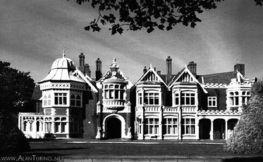
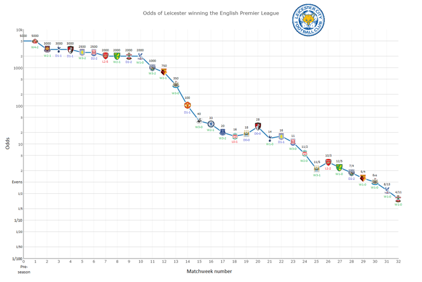
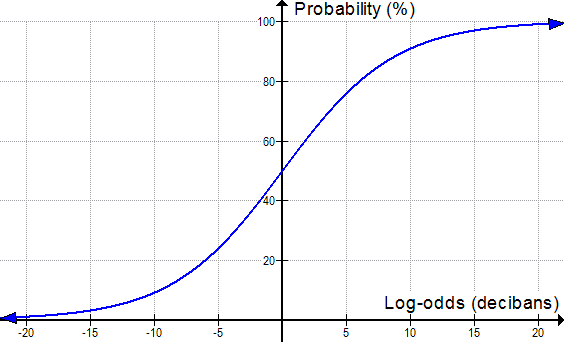

#Lecture 2: Bayesian Inference

---

 
 

"In so far as a scientific statement speaks about reality, it must be falsifiable; and in so far as it is not falsifiable, it does not speak about reality."

* [Karl Popper](https://en.wikipedia.org/wiki/Karl_Popper) 

---

#Frequentist vs Bayesian Probability

In the frequentist view, probabilities represent long run frequencies of events.

$$
$$

In the Bayesian view, probability is used to quantify our uncertainty about something; hence it is fundamentally related to information theory.
$$
$$
One big advantage of the Bayesian interpretation is that it can be used to model our uncertainty about events that do not have long term frequencies or otherwise fit into a frequentist paradigm

---

Leicester City FC won the Premiere League Championship in 2015-16. It was quite an [amazing story](https://www.reddit.com/r/sports/comments/44w18p/if_you_are_not_watching_the_premier_league_here/).
$$
$$
[William Hill](http://sports.williamhill.com/bet/en-gb), an England-based sportsbook, had the Foxes as 5,000:1 long shots to win the Premier League before the 2015-16 season

---

#How Crazy is 5,000:1?

Here are some other bets (legal in England, not the U.S.) that were offered at those same odds by William Hill in August of 2015:

* Elvis is found alive.
* Christmas 2015 is the warmest day of the year in England.
* Kim Kardashian becomes the U.S. president in 2020.
* Barack Obama plays cricket for England after he leaves Oval Office.

---

 [source](https://www.reddit.com/r/dataisbeautiful/comments/4dm169/odds_on_leicester_to_win_the_premier_league_after/)
 

---

#Bayes' Theorem V1

$$
p(H | E) = \frac{p(E | H) p(H)}{p(E | H) p(H) + p(E | H^c) p(H^c)}
$$

---

#Exercise

Suppose that there are two duffel bags, each containing a number of \$1,000 casino chips.  In both bags, 40% of the chips are real and the rest are counterfeit.  Futhermore, in both bags, some chips are from Ceasar's Palace and the rest are from Harrah's.  
 
 
In the first bag, 30% of the real chips are Ceasar's, and 10% of the counterfeit chips are Ceasar's. In the second bag,  90% of the real chips are Ceasar's, and 30% of the counterfeit chips are Ceasar's.  
$$
$$
Would you rather have a Ceasar's chip from the first or second bag?  How about a Harrah's chip?

---

---

$p(real|Ceasar's)$ and $p(real|Harrah's)$ have two degrees of freedom among them even when $p(real)$ is fixed - so there's no reason why one quantity shouldn't change while the other remains constant. 
$$
$$
In the second bag, the proportion of Ceasar's chips that are real is the same as in the first bag, but a much larger fraction of the chips are from Ceasar's.  This alters the set of Harrah's chips in such a way that the proportions do in fact change.  

---

#Liklihood Ratios

The probability that a test gives a true positive divided by the probability that a test gives a false positive is known as the likelihood ratio of that test: 
$$
\frac{p(E | H)}{p(E | H^c)}
$$

---

Using the casino of origin as a test for a chip's value in the above problem yields two different liklihood ratios.
$$
$$
$\frac{p(real | Ceasar's)}{p(real | Harrah's)}$ is approximately 1.96 for the first bag and 7.66 for the second bag.
$$
$$
What does this mean?

---

The likelihood ratio $p(E | H) / p(E | H^c)$, determines how much observing $E$ slides the probability for $H$, i.e. the strength of $E$ as evidence for $H$.  
$$
$$
To borrow Alfred Korzybski’s famous [map/territory metaphor](https://en.wikipedia.org/wiki/Map%E2%80%93territory_relation), evidence is what connects the “map” (your hypothesis $H$) with the “territory” in the real world (the evidence $E$).

---

The likelihood ratio tells us everything there is to know about the meaning of a positive result.  
$$
$$
But it doesn't tell us the meaning of a negative result, and it doesn't tell us how often the test is useful.  

---

For example, a test with a hit rate of 80% for patients with a certain cancer and a false positive rate of 9.6% for healthy patients has the same likelihood ratio as a test with an 8% hit rate and a false positive rate of 0.96%.  
$$
$$
Although these two tests have the same likelihood ratio, the first test is more useful in every way - it detects disease more often, and a negative result is stronger evidence of health.

---

#Bayes' Theorem V2

$$
\frac{p(H)}{p(H^c)} * \frac{p(E | H)}{p(E | H^c)} = \frac{p(H | E)}{p(H^c | E)}
$$

---

It is axiomatic that beliefs by themselves do not cause events to occur (i.e. the territory should effect the map, not vice-versa).
$$
$$
If you fill your car’s tank with fuel, the fuel gauge will read full. 
$$
$$
If you look at the gauge, you can observe that the needle is in the “full” position and you can form a reliable belief that the tank is full. 

---

What you can’t do is cause the tank to become full by simply believing it to be full.
$$
$$
This would be like gluing the fuel gauge’s needle in the “full” position and then expecting never to run out of gas. 

---

#[p-values considered harmful](http://www.nature.com/news/scientific-method-statistical-errors-1.14700)

However in the frequentist methodology, changes in a model do effect outcomes even when the observed data don't change.

---

#Example: Coin tosses

Suppose you toss a coin $n = 12$ times and observe $h = 9$ heads. If $n$ is fixed and $h$ is random then the relevant model is binomial:

$$
Bin(h | n, p) = {n \choose h} p^h (1-p)^{n-h}
$$

---

Suppose moreover that you are a good frequentist and that your null hypothesis $H_0$ is that the coin is fair. The one-sided p-value for that hypothesis is:
$$
P(h \geq 9 | H_0) = \sum_{h=9}^{12} Bin(h | n, p) = \sum_{h=9}^{12}  {n \choose h} 0.5^{12} = 0.07 \geq 0.05
$$

which would lead you to accept your null hypothesis that the coin is fair.

---

Now suppose that I told you I had kept tossing the coin until I observed $t = 3$ tails.
 
In this case $t$ is fixed, $n$ and $h$ are random, and the relevant model is negative binomial:
$$
NegBin(h | t, p) = {h +t -1 \choose t-1} p^h (1-p)^t
$$

---

Using the same null hypothesis we now get a p value of:
$$
P(h \geq 9 | H_0) = \sum_{h =9}^\infty {h + 3 -1 \choose 2} 0.5^h 0.5^3 = 0.03 \leq 0.05
$$
which would lead you to reject your null hypothesis and say that there is significant bias in the coin. 

---

This violates our axiom regarding beliefs. The data are the same, so our inferences about the coin should be the same as well.
$$
$$
These sorts of effects lead frequentists to make experimental decisions solely on the basis of how it would effect a hypothetical model.

---

As a result many organizations use Bayesian methods, especially ones tasked with making timed decisions under uncertainty. 
$$
$$
For example, in the past 10 years the US FDA has [become](http://www.fda.gov/RegulatoryInformation/Guidances/ucm071072.htm
) [increasingly](http://www.nature.com/nrd/journal/v5/n1/full/nrd1927.html) [supportive](https://www.ivtnetwork.com/sites/default/files/FDA%20Bayesian%20Statistics%20Guidance%20for%20Medical%20Device%20Clinical%20Trials.pdf) of Bayesian methods.

---

#Banburismus

This organizational approach originated at Bletchley Park during the Second World War with the [Banburismus](https://en.wikipedia.org/wiki/Banburismus).
$$
$$
[I.J. Good](https://en.wikipedia.org/wiki/I._J._Good) and Alan Turing were the first to suggest that credibility and evidence should be measured in log-odds, or [bans](https://en.wikipedia.org/wiki/Ban_(unit)). 
$$
$$
The ban is essentially the same measure as a bit ($1$ ban $= \log_2(10)$ bits), though the ban predated Shannon's bit by about eight years.

---

#Decibels?

Bans are a decibel measure of the weight of evidence in favour of a hypothesis: 
$$
\log_{10}(\frac{p(E | H)}{p(E | H^c)})
$$

[Decibels](https://en.wikipedia.org/wiki/Decibel) are widely used in engineering for measuring exponential differences of intensity.  
$$
$$
Thus, the ratio of $P$ (measured quantity) to $P_0$ (context-dependent baseline reference quantity) expressed my a decibel quanity $L_P$:

$$
L_P= 10\log_{10}(\frac{P}{P_0})
$$

---

For example, if the sound from an automobile horn carries 10,000 times as much energy (per square meter per second) as the sound from an alarm clock, the automobile horn would be 40 decibels louder.  
 
 
The sound of a bird singing might carry 1,000 times less energy than an alarm clock, and hence would be 30 decibels softer.  

---

---

<table style="width: auto; border: 1px solid #ddd; margin: 1px auto;" align="center">
<tbody>
<tr>
<td style="vertical-align: top; border: 1px solid #ddd; padding: 10px;">

<strong>Chances of&#8230; 
</strong>

</td>
<td style="vertical-align: top; border: 1px solid #ddd; padding: 10px;">

<strong>Probability</strong>

</td>
<td style="vertical-align: top; border: 1px solid #ddd; padding: 10px;">

<strong>Odds</strong>

</td>
<td style="vertical-align: top; border: 1px solid #ddd; padding: 10px;">

<strong>Log-odds 
</strong>

(in decibans)

</td>
</tr>

<tr>
<td style="vertical-align: top; border: 1px solid #ddd; padding: 10px;">

A ticket winning the 
Grand Prize in the 
Powerball Lottery<a class="fn-ref-mark" href="http://www.powerball.com/powerball/pb_prizes.asp" id="refmark-4">[4]</a>

</td>
<td style="vertical-align: top; border: 1px solid #ddd; padding: 10px;">

0.000000571%

</td>
<td style="vertical-align: top; border: 1px solid #ddd; padding: 10px;">

1 : 175,223,510

</td>
<td style="vertical-align: top; border: 1px solid #ddd; padding: 10px;">

-82.44

</td>
</tr>

<tr>
<td style="vertical-align: top; border: 1px solid #ddd; padding: 10px;">

Being dealt a 
royal flush in poker

</td>
<td style="vertical-align: top; border: 1px solid #ddd; padding: 10px;">

0.00015%

</td>
<td style="vertical-align: top; border: 1px solid #ddd; padding: 10px;">

1 : 649,739

</td>
<td style="vertical-align: top; border: 1px solid #ddd; padding: 10px;">

-58.1

</td>
</tr>

<tr>
<td style="vertical-align: top; border: 1px solid #ddd; padding: 10px;">

Rolling a twelve 
with two 6-sided dice

</td>
<td style="vertical-align: top; border: 1px solid #ddd; padding: 10px;">

2.78%

</td>
<td style="vertical-align: top; border: 1px solid #ddd; padding: 10px;">

1 : 35

</td>
<td style="vertical-align: top; border: 1px solid #ddd; padding: 10px;">

-15.4

</td>
</tr>

<tr>
<td style="vertical-align: top; border: 1px solid #ddd; padding: 10px;">

A fair coin landing 
on heads

</td>
<td style="vertical-align: top; border: 1px solid #ddd; padding: 10px;">

50.0%

</td>
<td style="vertical-align: top; border: 1px solid #ddd; padding: 10px;">

1 : 1

</td>
<td style="vertical-align: top; border: 1px solid #ddd; padding: 10px;">

0

</td>
</tr>

<tr>
<td style="vertical-align: top; border: 1px solid #ddd; padding: 10px;">

At least one head 
in ten coin flips

</td>
<td style="vertical-align: top; border: 1px solid #ddd; padding: 10px;">

99.9%

</td>
<td style="vertical-align: top; border: 1px solid #ddd; padding: 10px;">

1023 : 1

</td>
<td style="vertical-align: top; border: 1px solid #ddd; padding: 10px;">

30.1

</td>
</tr>

<tr>
<td style="vertical-align: top; border: 1px solid #ddd; padding: 10px;">

At least one birthday 
shared in a group of 
100 random people

</td>
<td style="vertical-align: top; border: 1px solid #ddd; padding: 10px;">

99.99997%

</td>
<td style="vertical-align: top; border: 1px solid #ddd; padding: 10px;">

3,254,689 : 1

</td>
<td style="vertical-align: top; border: 1px solid #ddd; padding: 10px;">

65.1

</td>
</tr>

<tr>
<td style="vertical-align: top; border: 1px solid #ddd; padding: 10px;">

Surviving 1km of travel 
on Canadian roads<a class="fn-ref-mark" href="https://www.tc.gc.ca/eng/motorvehiclesafety/tp-1317.htm" id="refmark-5">[5]</a>

</td>
<td style="vertical-align: top; border: 1px solid #ddd; padding: 10px;">

99.99999934%

</td>
<td style="vertical-align: top; border: 1px solid #ddd; padding: 10px;">

151,515,151 : 1

</td>
<td style="vertical-align: top; border: 1px solid #ddd; padding: 10px;">

81.8

</td>
</tr>

</tbody>
</table>

---

Suppose we start with a prior probability of 1% that a woman has breast cancer, corresponding to an odds ratio of 1:99.  And then we administer three tests of likelihood ratios 25:3, 18:1, and 7:2.  

\begin{align} 
10 & \log_{10}(1/99) = -20
\newline
10 &\log_{10}(25/3) = 9
\newline
10 &\log_{10}(18/1) = 13
\newline
10 &\log_{10}(7/2)  = 5
\newline
\end{align} 

---

It starts out as fairly unlikely that a woman has breast cancer - our credibility level is at -20 decibans.  
 
 
Then three test results come in, corresponding to 9, 13, and 5 decibans of evidence.  
 
 
This raises the credibility level by a total of 27 decibans, meaning that the prior credibility of -20 decibans goes to a posterior credibility of 7 decibans.  
 
 
So the odds go from 1:99 to 5:1, and the probability goes from 1% to around 83%.

---

#Exercise

Suppose we are trying to discriminate between an unbiased die and a loaded one that gives $6$ one third of the time. 
$$
$$
How many decibans of evidence does the sequence $\\{6,4,6,6,2,6,5,6,5,6,6,6\\}$ provide in favor of the biased hypothesis? What are the posterior odds of the die being fair?

---

---

Let $H$ be the hypothesis that the die is biased. In that case the evidence in decibans is

$$
10 \log_{10}(\frac{p(E | H)}{p(E | H^c)}) = 10 \log_{10}(\frac{1/3}{1/6}) = 3.01
$$
when $E$ is the event that the die rolls a $6$, and 
$$
10 \log_{10}(\frac{p(E | H)}{p(E | H^c)}) = 10 \log_{10}(\frac{2/3}{5/6}) = -0.97
$$
otherwise. So the sequence provides $20.2$ decibans of evidence for the biased die hypothesis. The posterior odds are $2^8 \cdot (0.8)^4: 1 = 105:1 $ against the die being fair.

---

#Falsification 

In the graph above it’s worth noticing that we never actually get to 100% certainty though, no matter how much strong evidence we observe. 
$$
$$
Thinking in terms of log-odds reminds us that all ideas in science are tentative to some degree, and could have to be revised in light of strong enough opposing evidence.

---

If $p(E|H) \sim 1$ (i.e. the hypothesis makes a definitive prediction) - then observing $E^c$ very strongly falsifies $H$.  
$$
$$
However if $p(E|H) \sim 1$,  and we observe $E$, this doesn't definitely confirm the hypothesis; there might be some other condition $G$ such that $p(E|G) \sim 1$, in which case observing $E$ doesn't favor $H$ over $G$.  

---

For observing $E$ to definitely confirm $H$, we would have to know, not that $p(E|H) \sim 1$, but that $p(E|H^c) \sim 0$, which requires ranging over all possible alternative explanations. 
$$
$$
In other words hypotheses can be definitely falsified, but never definitely confirmed.
$$
$$
This is sometimes referred to as the [black swan fallacy](https://en.wikipedia.org/wiki/Falsifiability).

---

Assume that some piece of evidence $F$ is highly unlikely under hypothesis $H$, then $p(F|H)$ is infinitesimal and the likelihood ratio will also be infinitesimal. 
$$
$$
For example, if $p(F|H) = 0.000001$, and $p(F|H^c) = 0.01$, then the likelihood ratio $p(F|H)/p(F|H^c)$ will be 1:10000.  
$$
$$
This amounts to $-40$ decibels of evidence, meaning that observing $F$ greatly favors $H^c$ over $H$.   
 

---

#Exercise

In the die example above, show that the expectation of evidence in decibans $\mathit{E}(10 \log_{10}(\frac{p(E | H)}{p(E | H^c)})) $ is less than zero when the die is in fact unbiased.

---

---

When the die is fair, there is a probability of $1/6$ that the factor will be $1/3 / 1/6 = 2$ and a probability of $5/6$ that the factor will be $4/5$. Hence 
\begin{align} 
\mathit{E}\left[10 \log_{10}(\frac{p(E | H)}{p(E | H^c)})\right] &\leq  10 \log_{10}(\mathit{E}\left[\frac{p(E | H)}{p(E | H^c)}\right])
\newline
&= 10 \log_{10}( \frac{1}{6} * 2 + \frac{5}{6} * \frac{4}{5} )
\newline
&= 10 \log_{10}( 1)
\newline
&= 0
\end{align}
by Jensen's inequality.

